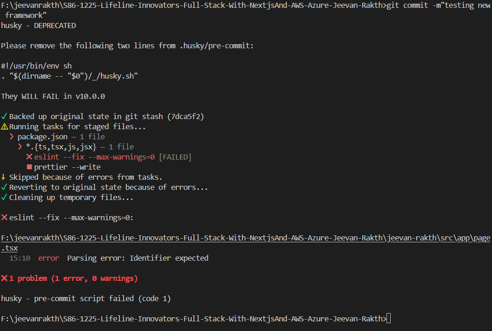

# Jeevan Rakth

Lifeline Innovators' full-stack initiative that connects urgent blood requirements with available donors in real time. The app streamlines discovery, verification, and communication so hospitals and community responders can coordinate faster during critical scenarios.

## Folder Structure

```
jeevan-rakth/
├── public/
├── src/
│   ├── app/
│   │   ├── globals.css
│   │   ├── layout.tsx
│   │   └── page.tsx
│   ├── components/
│   └── lib/
├── eslint.config.mjs
├── next.config.ts
├── package.json
└── tsconfig.json
```

- `public/` static assets used across the UI, including the app screenshot.
- `src/app/` Next.js App Router entry point with global styles, layout shell, and root page.
- `src/components/` shared UI primitives and composite widgets (currently staged for upcoming sprint work).
- `src/lib/` utilities for API access, data adapters, and configuration helpers.
- Config files at the project root ensure linting, TypeScript, and Next.js runtime settings stay consistent for everyone on the team.

## Setup Instructions

1. Install dependencies: `cd jeevan-rakth && npm install`
2. Start the development server: `npm run dev`
3. Open the app at `http://localhost:3000`
4. Run the linter before committing: `npm run lint`

## Reflection

We adopted the Next.js App Router layout to keep routing, layouts, and data-fetching logic co-located. Shared UI and utility logic live in `components` and `lib`, letting parallel squads extend the design system or connect to additional services without touching core pages. Centralized configuration files keep build tooling aligned, which de-risks onboarding. As future sprints introduce donor dashboards, hospital triage views, and integrations with Azure/AWS services, this separation lets each slice scale independently while preserving consistent UX and deployment workflows.

## Screenshot
